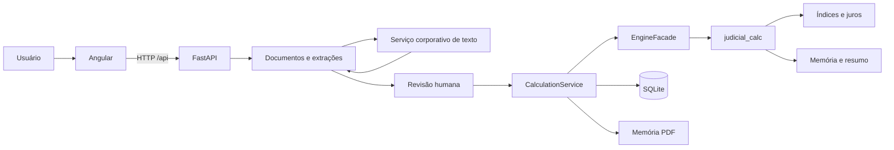

# Calculadora Judicial

Aplicação web para leitura assistida de documentos judiciais, revisão humana dos parâmetros e cálculo determinístico de débitos. O projeto mantém três responsabilidades separadas: a interface Angular coleta e apresenta informações; o backend FastAPI valida, audita e coordena o fluxo; o pacote Python `judicial_calc` executa as fórmulas financeiras.

A IA é usada somente para sugerir informações extraídas dos documentos. Ela não substitui a revisão humana e não executa as fórmulas do cálculo. Critérios jurídicos, regulatórios, de retenção e de uso institucional precisam ser validados pelo Jurídico, Compliance e/ou DPO quando aplicável.

## 1. Como iniciar

### Backend em desenvolvimento

Use o iniciador do projeto, e não `uvicorn --reload` diretamente na raiz:

```powershell
.\scripts\start-backend-dev.ps1
```

No CMD:

```cmd
scripts\start-backend-dev.cmd
```

No Linux/macOS:

```bash
./scripts/start-backend-dev.sh
```

Todos esses arquivos chamam o mesmo ponto de entrada:

```bash
python scripts/run_backend.py --reload
```

### Backend sem recarga automática

```powershell
.\scripts\start-backend.ps1
```

### Backend e frontend juntos

Depois de instalar as dependências do frontend:

```powershell
.\scripts\start-dev.ps1
```

ou:

```bash
./scripts/start-dev.sh
```

O iniciador conjunto lê `config/runtime.json`, aguarda o backend ficar saudável e só então inicia o Angular. A configuração de proxy do Angular é criada temporariamente com o host e a porta efetivamente usados pelo backend.

## 2. Correção do warning do WatchFiles

O warning mostrado no terminal ocorria quando o observador de arquivos do Uvicorn enxergava a raiz inteira do projeto. Como `frontend/node_modules` contém milhares de arquivos Python internos de dependências como `node-gyp`, alterações feitas pelo npm eram interpretadas como mudanças no backend e provocavam mensagens do tipo:

```text
WatchFiles detected changes in 'frontend/node_modules/...'. Reloading...
```

A inicialização foi centralizada em `scripts/run_backend.py`. Quando `--reload` está ativo, somente estes diretórios são observados:

```text
backend/
src/
config/
prompts/
```

Além disso, `frontend/` e `frontend/node_modules/` estão explicitamente excluídos. Os tipos observados são `*.py`, `*.json` e `*.md`, permitindo que alterações reais no backend, configurações e prompts reiniciem a API sem acompanhar arquivos do npm.

A regra fica em `config/runtime.json`, e a suíte contém testes que impedem a reintrodução acidental de `frontend/node_modules` no escopo de recarga.

## 3. Visão rápida da arquitetura



A explicação detalhada dos componentes, limites entre camadas e fluxo de dados está em [`docs/ARQUITETURA.md`](docs/ARQUITETURA.md).

## 4. Organização do projeto

```text
backend/                 API, contratos, serviços, repositórios e persistência
config/                  parâmetros de execução e políticas do sistema
docs/                    documentação técnica e operacional
evals/                   casos de avaliação da extração por IA
examples/                exemplos sem dados reais de produção
frontend/                aplicação Angular
prompts/                 instruções especializadas da extração documental
scripts/                 inicialização, validações e geração de documentação
src/judicial_calc/       motor determinístico de cálculo
tests/                   testes unitários, integração e cenários de referência
```

Para entender o objetivo de cada arquivo/módulo, consulte [`docs/GUIA_MODULOS.md`](docs/GUIA_MODULOS.md). Para assinaturas de classes, métodos e funções, consulte [`docs/REFERENCIA_CODIGO.md`](docs/REFERENCIA_CODIGO.md).

## 5. Configuração centralizada

A configuração está separada por responsabilidade:

| Arquivo | Responsabilidade |
|---|---|
| `config/runtime.json` | host, portas, workers e escopo de recarga automática |
| `config/app.settings.json` | limites operacionais não secretos do backend |
| `config/calculation_policy.json` | campos, opções e padrões da política de cálculo |
| `config/extraction_tasks.json` | limites de saída das tarefas de extração |
| `.env` | credenciais e valores específicos do ambiente; nunca deve ser versionado |
| `frontend/public/app-config.json` | caminho público da API e parâmetros do navegador |

Variáveis de ambiente têm precedência sobre valores de execução quando há um mapeamento explícito. Exemplos e regras estão em [`docs/CONFIGURACAO.md`](docs/CONFIGURACAO.md).

## 6. Fluxo do cálculo

Em alto nível, uma execução segue estas etapas:

1. o Angular monta o pedido com parcelas e parâmetros revisados;
2. o FastAPI valida o contrato recebido;
3. `CalculationService.execute()` normaliza o pedido, calcula hashes de rastreabilidade e controla a execução;
4. `EngineFacade.calculate()` converte o contrato HTTP para os tipos do motor;
5. `calcular_debitos()` prepara as parcelas, cria os contextos por tipo de dano, calcula cada linha e aplica os ajustes finais;
6. o motor devolve `ResultadoCalculo`, contendo a memória detalhada e o resumo;
7. o backend serializa a resposta, registra auditoria e, quando aplicável, persiste o estado funcional, a execução e o PDF.

[`docs/FLUXO_CALCULO.md`](docs/FLUXO_CALCULO.md) contém um exemplo numérico verificado pela suíte, com cada função chamada, objetivo, entrada tipada e saída esperada.

## 7. Documentação principal

- [`docs/ARQUITETURA.md`](docs/ARQUITETURA.md): arquitetura detalhada e diagramas.
- [`docs/FLUXO_CALCULO.md`](docs/FLUXO_CALCULO.md): execução passo a passo de um cálculo.
- [`docs/GUIA_MODULOS.md`](docs/GUIA_MODULOS.md): escopo e responsabilidade dos módulos.
- [`docs/CONFIGURACAO.md`](docs/CONFIGURACAO.md): arquivos de configuração e variáveis de ambiente.
- [`docs/MANUTENCAO.md`](docs/MANUTENCAO.md): roteiro seguro para manutenção e testes.
- [`docs/PARAMETROS.md`](docs/PARAMETROS.md): catálogo gerado dos parâmetros de cálculo.
- [`docs/REFERENCIA_CODIGO.md`](docs/REFERENCIA_CODIGO.md): referência gerada a partir das assinaturas e docstrings.
- [`docs/EXTRACAO_IA.md`](docs/EXTRACAO_IA.md): funcionamento da extração documental.
- [`docs/FEEDBACK_APRENDIZADO.md`](docs/FEEDBACK_APRENDIZADO.md): curadoria de exemplos revisados.
- [`docs/IA_TELEMETRIA_E_OTIMIZACAO.md`](docs/IA_TELEMETRIA_E_OTIMIZACAO.md): telemetria e limites de consumo.
- [`docs/MODEL_CARD.md`](docs/MODEL_CARD.md): escopo, limitações e controles da camada de IA.
- [`docs/DECISOES.md`](docs/DECISOES.md): decisões técnicas vigentes e suas justificativas.

## 8. Dados, segurança e privacidade

- Não coloque credenciais, tokens ou senhas em código, testes, prints, documentação ou arquivos JSON versionados.
- Não use dados reais de produção não anonimizados em desenvolvimento, exemplos ou testes.
- O arquivo `.env` é local. Use `.env.example` apenas como modelo sem segredos.
- O backend remove segredos do ambiente do processo Angular quando os dois serviços são iniciados juntos.
- Logs devem registrar eventos técnicos e identificadores seguros, sem reproduzir conteúdo integral de documentos ou credenciais.
- A política de retenção, acesso, descarte e eventual base legal para dados pessoais deve ser homologada institucionalmente antes do uso em produção.

## 9. Testes e validações

Backend e motor:

```bash
PYTHONPATH="src:." pytest -q
python scripts/validate_architecture.py
python -m compileall -q backend src scripts
```

Frontend, depois de instalar as dependências:

```bash
cd frontend
npm test
npm run build
```

Validação de sintaxe do iniciador conjunto:

```bash
node --check scripts/start-dev.mjs
```

## 10. Artefatos gerados

Alguns arquivos são derivados do próprio código e devem ser regenerados quando a fonte correspondente mudar:

```bash
python scripts/generate_parameter_catalog.py
python scripts/generate_parameter_docs.py
python scripts/generate_code_reference.py
python scripts/generate_engine_manifest.py
```

`docs/motor_sha256.json` representa a integridade do código de `src/judicial_calc`. Ele não deve ser editado manualmente.

## 11. Regra de manutenção

Evite colocar regra financeira no Angular ou nos routers HTTP. A interface apresenta e coleta dados; os routers validam e encaminham; os serviços coordenam; `src/judicial_calc` concentra o cálculo. Antes de alterar uma fórmula, adicione ou ajuste um teste de cenário que descreva claramente a entrada e a saída esperada.
