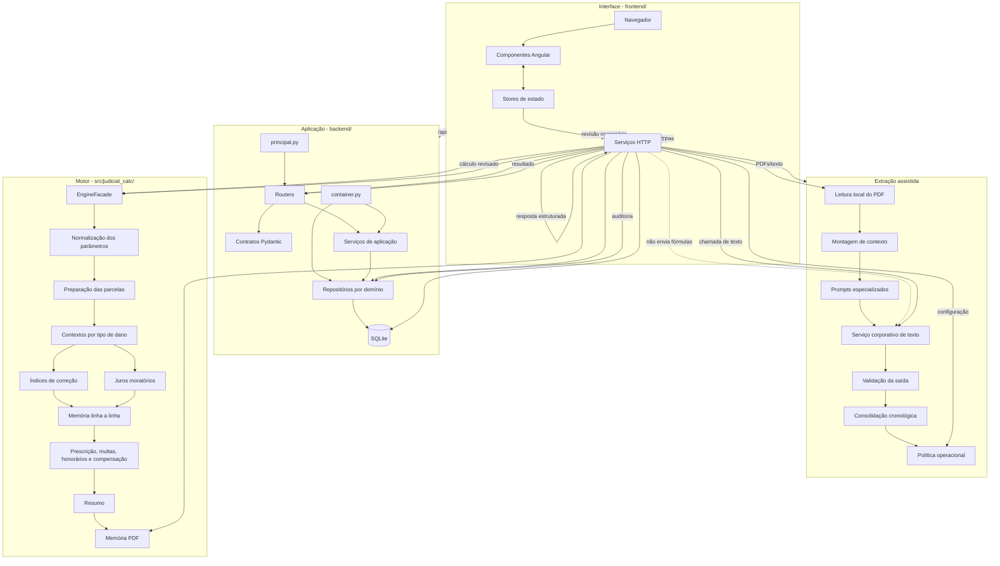
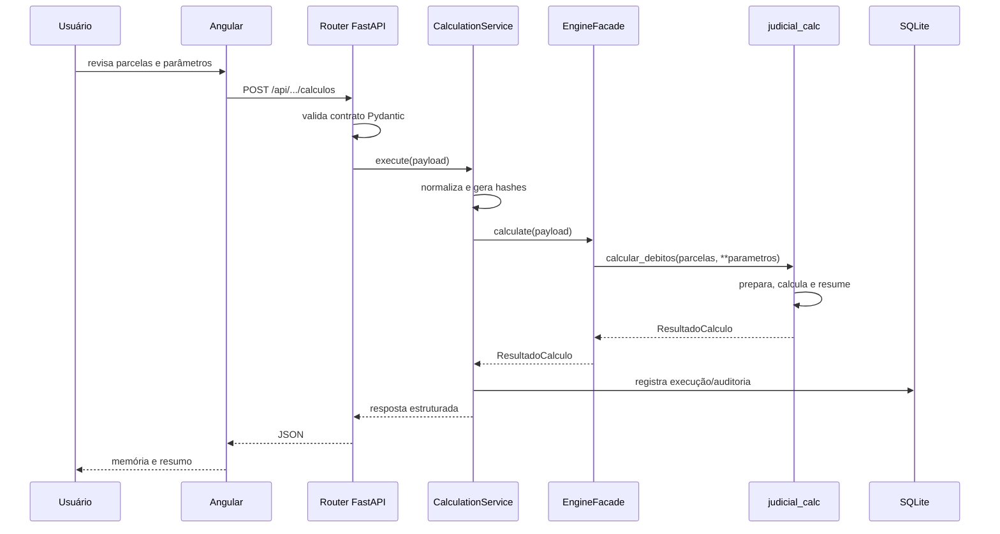

# Arquitetura da Calculadora Judicial

## 1. Objetivo

A arquitetura separa apresentação, coordenação, extração documental, persistência e cálculo. Essa separação evita que uma tela altere uma fórmula, que uma resposta da IA seja tratada como decisão final ou que regras financeiras fiquem espalhadas por vários pontos do projeto.

A regra central é simples:

> Angular apresenta e coleta; FastAPI valida e coordena; a IA sugere; o usuário revisa; `judicial_calc` calcula de forma determinística.

## 2. Diagrama detalhado



## 3. Caminho de uma requisição de cálculo



## 4. Camadas e responsabilidades

### 4.1 `frontend/`

Responsável pela experiência do usuário. Pode formatar, validar campos básicos, manter estado temporário e chamar a API. Não deve implementar fórmulas financeiras nem decidir critérios jurídicos.

### 4.2 `backend/contracts/`

Define o formato aceito e devolvido pela API. A validação acontece na fronteira: tipos, campos obrigatórios, intervalos e estruturas inválidas são rejeitados antes de chegar ao motor.

### 4.3 `backend/routers/`

Expõe endpoints HTTP. Cada rota deve ser curta: recebe dados já validados, chama um serviço e converte o resultado em resposta HTTP. Regra de negócio não deve crescer dentro do router.

### 4.4 `backend/services/`

Coordena casos de uso: documentos, extração, revisão, cálculo, índices, lote e qualidade. Essa camada decide a ordem das operações, mas não replica as fórmulas do motor.

### 4.5 `backend/repositories/` e `backend/persistence/`

Centralizam leitura e gravação no SQLite. Cada repositório cuida de um assunto. A camada de persistência prepara conexão, estrutura das tabelas e transações.

### 4.6 `src/judicial_calc/`

Contém o motor determinístico. Para a mesma entrada, a mesma configuração e as mesmas tabelas de índices, a saída deve ser reproduzível. O motor não depende do Angular e não depende de resposta de IA.

### 4.7 `prompts/`

Cada arquivo descreve uma tarefa específica de extração. Separar os prompts reduz ambiguidades e permite testar alterações por assunto.

### 4.8 `config/`

Armazena parâmetros não secretos. Configuração de execução, política de cálculo e limites de extração ficam fora do código para reduzir alterações desnecessárias em funções.

## 5. Fluxo documental

```text
Upload do PDF
    -> armazenamento controlado
    -> leitura local da camada textual
    -> divisão por tarefa de extração
    -> prompt especializado + contexto
    -> serviço corporativo de texto
    -> validação estrutural da resposta
    -> consolidação de evidências
    -> revisão humana
    -> cálculo
```

A camada de IA não deve ser tratada como fonte normativa. Ela produz uma sugestão rastreável. Quando a informação não puder ser determinada com segurança, o fluxo deve preferir ausência/alerta em vez de inventar um valor.

## 6. Fluxo do motor de cálculo

```text
CalculationRequest
    -> EngineFacade.calculate()
    -> lista de parcelas + dicionário de parâmetros
    -> calcular_debitos()
       -> _prepare_installments()
       -> _build_damage_contexts()
       -> _build_memory()
          -> cálculo de correção e juros por parcela
       -> _apply_calculation_post_processing()
       -> _montar_resumo()
    -> ResultadoCalculo(memoria, resumo, parametros)
```

Os módulos `indices/`, `interest/` e `data_sources/` são usados apenas quando o tipo de cálculo selecionado precisa deles.

## 7. Persistência e rastreabilidade

O banco local separa assuntos em repositórios. O cálculo possui duas noções diferentes que não devem ser confundidas:

- **estado funcional do cálculo**: conjunto de parâmetros e parcelas escolhido pelo usuário;
- **execução técnica**: uma execução concreta desse estado, com hashes, duração e artefatos.

Essa separação permite rastrear uma nova execução sem alterar silenciosamente o estado funcional que o usuário revisou. O histórico de estados do cálculo é requisito de auditoria do produto, não uma referência a releases do software.

## 8. Configuração e injeção de dependências

`backend/container.py` cria as dependências em um único ponto. Serviços recebem explicitamente os repositórios e colaboradores de que precisam. O objetivo é permitir manutenção e testes sem procurar objetos globais espalhados pelo código.

`config/runtime.json` controla host, portas, workers e recarga. `backend/config.py` controla os parâmetros operacionais do backend e lê segredos somente do ambiente ou `.env` local.

## 9. Observação de arquivos em desenvolvimento

`scripts/run_backend.py` é o único lugar que chama `uvicorn.run`. Em modo de recarga ele observa apenas `backend/`, `src/`, `config/` e `prompts/`. O frontend e `node_modules` são excluídos, impedindo que alterações do npm reiniciem o backend.

## 10. Limites arquiteturais

As seguintes regras devem permanecer verdadeiras:

1. Angular não contém fórmula financeira.
2. Routers não contêm SQL.
3. Repositórios não executam regra de cálculo.
4. `judicial_calc` não depende da IA.
5. Segredos não ficam em arquivos versionados.
6. Dados reais de produção não entram em testes ou documentação.
7. Mudanças em fórmulas exigem testes com entrada e saída esperadas.
8. Decisões jurídicas sobre parâmetros concretos continuam sujeitas à revisão humana e validação institucional.
