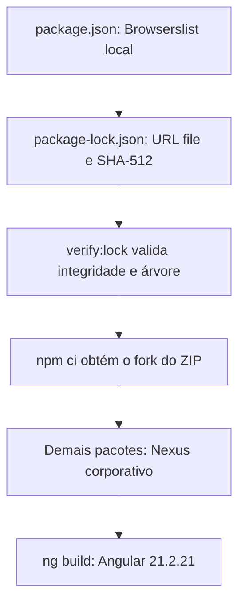

# Dependências npm e governança corporativa

## Objetivo e decisão técnica

O projeto continua utilizando Angular **21.2.21** e a API de seleção de navegadores do **Browserslist**. Para eliminar a exigência de download de `update-browserslist-db`, utiliza uma **cópia local e modificada de Browserslist 4.28.1**, com a licença MIT original preservada. Essa não é uma biblioteca fictícia nem um atalho de autenticação: a cópia contém a implementação real de Browserslist, com mudanças mínimas, rastreáveis e específicas.

**Atenção:** esta alternativa **precisa de aprovação do time de governança/segurança** para redistribuir/manter uma cópia de dependência de terceiros. A existência do ZIP e a possibilidade técnica de instalá-lo não significam homologação do pacote ou de todas as outras dependências. Não configure o npm para contornar o Nexus corporativo.

## O que mudou

| Arquivo | Alteração e justificativa |
| --- | --- |
| `frontend/vendor/browserslist-no-updater/` | Fontes originais de Browserslist 4.28.1, licença MIT e alterações documentadas em `FORK_NOTES.md`. |
| `frontend/vendor/browserslist-no-updater-4.28.1.tgz` | Pacote local criado com `npm pack`; é instalado sem download remoto desse componente. |
| `frontend/package.json` | Dependência de desenvolvimento local + override `$browserslist` para atender Angular e Babel sem resolução relativa errada. |
| `frontend/package-lock.json` | Traz a origem local, integridade SHA-512 e **não contém `update-browserslist-db`** na árvore de pacotes. |
| `frontend/scripts/validate-dependency-lock.mjs` | Confere origem, integridade e ausência do atualizador antes do build. |

A versão do Browserslist usada anteriormente era **4.28.9**; a cópia local parte de **4.28.1**, que satisfaz os intervalos `^4.26.0` (Angular build) e `^4.24.0` (Babel) presentes no lockfile. Essa alteração de versão e a manutenção de um fork são trade-offs explícitos que exigem revisão técnica, de licença e de segurança. A seleção de navegadores continua baseada nos outros dados e dependências de Browserslist, incluindo `caniuse-lite`; seus dados **não são atualizados automaticamente**.

## Fluxo visual



## Instalação no Windows (PowerShell)

Descompacte o ZIP completo, incluindo a pasta `frontend/vendor`. Em um PowerShell aberto na raiz do projeto:

```powershell
cd frontend
npm run verify:lock
npm ci
npm run build
```

Se o `npm ci` receber 403 para **outro** pacote, anote apenas nome, versão e status HTTP e consulte os responsáveis pelo Nexus. Nunca publique arquivos `.npmrc` com credenciais ou logs com tokens. Avisos `EPERM` do Windows são independentes de respostas 403 do Nexus.

## Atualização e rollback

Para atualizar dados de navegadores, solicite atualização aprovada de `caniuse-lite`, regenere o lockfile no ambiente autorizado, execute `npm ci`, testes e build e registre versões/resultado. Reavalie o fork em cada atualização do Angular/Browserslist. Caso a governança não aprove o fork, restaure a versão anterior de `frontend/package.json` e `frontend/package-lock.json` e solicite a liberação do pacote original no Nexus.

## Validação e limites

O teste estrutural `npm run verify:lock` e a simulação `npm ci --offline --dry-run` não fazem download real. A validação de consultas do Browserslist pode ser feita localmente contra as mesmas versões de dados. Uma compilação Angular completa e a instalação real de todas as dependências **dependem da disponibilidade/autorizações do Nexus** no ambiente corporativo. Nenhum motor financeiro, prompt, backend ou componente Angular foi alterado nesta intervenção.
