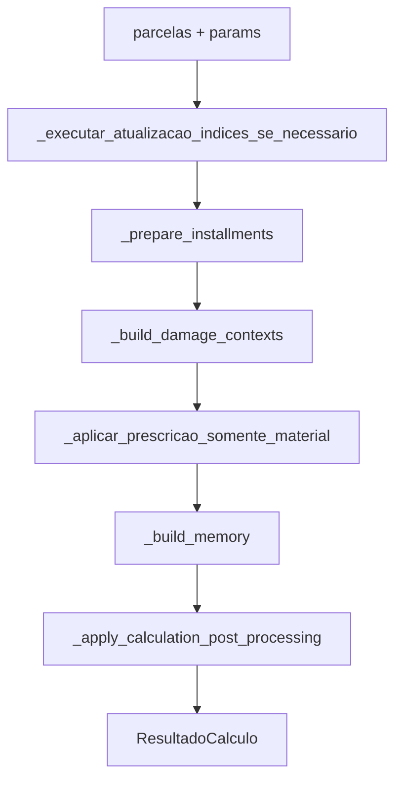

# Fluxo completo de um cálculo

Este documento acompanha um cálculo sintético do início ao fim. O objetivo é permitir que uma pessoa sem conhecimento prévio do projeto entenda qual função é chamada, o que ela recebe e o que devolve.

O exemplo abaixo foi executado contra o próprio motor e também corresponde a um cenário de referência da suíte de testes. Ele serve apenas para explicar o fluxo técnico; não define qual índice, juros ou critério deve ser usado em um processo real.

## 1. Entrada usada no exemplo

### Parcelas

Tipo esperado pelo motor:

```python
list[dict[str, Any]] | pandas.DataFrame
```

Exemplo:

```python
installments = [
    {
        "item": 1,
        "data": "2025-01-01",
        "valor_singelo": "1234.56",
        "descricao": "Base",
        "verba_tipo": "dano_material",
    }
]
```

### Parâmetros

Tipo esperado:

```python
dict[str, Any]
```

Exemplo:

```python
parameters = {
    "indice": "sem_correcao",
    "mes_atualizacao": "março",
    "ano_atualizacao": 2026,
    "juros_moratorios_tipo": "sem_juros",
    "auto_atualizar_planilhas_indices": False,
}
```

Nesse cenário, o valor foi escolhido para demonstrar a passagem pelos módulos sem depender de uma tabela externa: não há correção monetária, juros, multa, honorários nem compensação.

## 2. Caminho completo pela aplicação

Quando a chamada vem pela interface web, o caminho é:

```text
Angular
  -> CalculationApiService
  -> router de cálculos FastAPI
  -> CalculationService.execute()
  -> EngineFacade.calculate()
  -> calcular_debitos()
  -> ResultadoCalculo
  -> resposta HTTP
  -> Angular
```

Quando o motor é chamado diretamente em Python, o caminho começa em `calcular_debitos()`.

## 3. Etapa A — contrato HTTP

### Componente

`backend/contracts/calculation_input.py`

### Objetivo

Representar o pedido de cálculo com tipos conhecidos antes que a regra financeira seja executada.

### Entrada

JSON recebido pela API.

### Saída

Objeto Pydantic `CalculationRequest` com parcelas e parâmetros validados.

### Por que existe

A validação na entrada impede que uma estrutura inesperada chegue ao meio do cálculo. Em vez de falhar depois de várias etapas, o sistema informa o problema na fronteira.

## 4. Etapa B — `CalculationService.execute()`

### Arquivo

`backend/services/calculation.py`

### Assinatura principal

```python
CalculationService.execute(
    payload: CalculationRequest,
    pdf: bool = False,
    expected_indices_hash: str | None = None,
    *,
    calculation_id: str | None = None,
    base_version: int | None = None,
    expected_current_version: int | None = None,
    actor: str = "system",
    persist_version: bool = True,
) -> VersionedCalculationResponse | bytes
```

### Objetivo

Coordenar uma execução completa. Essa função não contém as fórmulas. Ela:

1. normaliza a estrutura de parâmetros;
2. cria hashes de rastreabilidade;
3. impede que uma atualização concorrente de índices mude a execução no meio;
4. chama `EngineFacade.calculate()`;
5. monta metadados;
6. persiste execução/histórico quando solicitado;
7. registra auditoria;
8. devolve JSON estruturado ou PDF.

### Entrada

`CalculationRequest` já validado.

### Saída

`VersionedCalculationResponse` no cálculo normal ou `bytes` quando a rota solicita PDF.

## 5. Etapa C — `EngineFacade.calculate()`

### Arquivo

`backend/services/engine.py`

### Assinatura

```python
def calculate(self, payload: CalculationRequest) -> ResultadoCalculo
```

### Objetivo

Fazer a tradução entre o contrato HTTP e o motor. É a única fachada do backend para o cálculo determinístico.

### O que recebe

`CalculationRequest`.

### O que faz

1. transforma os parâmetros Pydantic em `dict[str, Any]`;
2. inclui critérios separados por tipo de dano quando existem;
3. valida combinações operacionais;
4. desativa atualização automática de arquivos nessa etapa, porque a atualização é controlada pelo backend;
5. converte as parcelas para `list[dict[str, Any]]`;
6. chama `calcular_debitos(installments, **params)`.

### Saída

`ResultadoCalculo`, definido em `src/judicial_calc/core/types.py`, contendo:

- `memoria: pandas.DataFrame`;
- `resumo: pandas.DataFrame`;
- `parametros: dict[str, Any]`.

## 6. Etapa D — `calcular_debitos()`

### Arquivo

`src/judicial_calc/services/calculation_service.py`

### Assinatura

```python
def calcular_debitos(
    parcelas: pandas.DataFrame | list[dict[str, Any]],
    **params: Any,
) -> ResultadoCalculo
```

### Objetivo

Ser o ponto principal do motor. A função coordena quatro fases e deixa cada regra específica em uma função menor.

### Fluxo interno



## 7. Etapa E — atualização controlada de índices

### Função

```python
_executar_atualizacao_indices_se_necessario(params: dict[str, Any]) -> dict[str, Any]
```

### Objetivo

Decidir se as planilhas locais precisam ser verificadas/atualizadas antes do cálculo.

### Entrada

Dicionário de parâmetros.

### Saída

Dicionário de status com informações como `executed`, `skipped`, `success` e `message`.

No exemplo, `auto_atualizar_planilhas_indices=False`, então nenhuma chamada externa é necessária.

## 8. Etapa F — `_prepare_installments()`

### Assinatura

```python
def _prepare_installments(
    parcelas: pandas.DataFrame | list[dict[str, Any]],
) -> pandas.DataFrame
```

### Objetivo

Criar uma tabela interna segura antes das fórmulas.

### Entrada do exemplo

```text
item=1
data="2025-01-01"
valor_singelo="1234.56"
descricao="Base"
verba_tipo="dano_material"
```

### Validações

A função exige as colunas:

```text
item
data
valor_singelo
```

Se `descricao` não vier, ela cria a coluna vazia. A data é convertida uma única vez para `datetime.date` e guardada em `_data_parcela`.

### Saída

`pandas.DataFrame` novo. O objeto original não é alterado.

## 9. Etapa G — `_build_damage_contexts()`

### Assinatura

```python
def _build_damage_contexts(
    frame: pandas.DataFrame,
    params: dict[str, Any],
) -> tuple[
    CalculoParams,
    dict[str, DamageCalculationContext],
    DamageCalculationContext,
]
```

### Objetivo

Preparar tudo que será reutilizado pelas parcelas antes do loop principal.

### Entrada

- `frame`: parcelas já preparadas;
- `params`: parâmetros brutos do cálculo.

### Trabalho executado

1. `CalculoParams.from_raw(params)` converte e valida os parâmetros;
2. `_parametros_por_dano(params)` separa critérios de dano material e dano moral;
3. `_precarregar_tabelas(...)` carrega somente as tabelas necessárias para cada contexto;
4. cada contexto reúne parâmetros, configuração tipada e tabelas.

### Saída

- configuração geral `CalculoParams`;
- dicionário de contextos por natureza de dano;
- contexto geral para uma linha que não tenha natureza reconhecida.

No exemplo existe somente `dano_material`.

## 10. Etapa H — prescrição

### Função

```python
_aplicar_prescricao_somente_material(
    df: pandas.DataFrame,
    cfg: CalculoParams,
) -> pandas.DataFrame
```

### Objetivo

Aplicar o corte temporal somente quando a configuração determina prescrição.

### Entrada do exemplo

A flag de prescrição está desativada por padrão.

### Saída do exemplo

A mesma parcela continua no cálculo.

## 11. Etapa I — `_build_memory()`

### Assinatura

```python
def _build_memory(
    frame: pandas.DataFrame,
    contexts: dict[str, DamageCalculationContext],
    general_context: DamageCalculationContext,
) -> pandas.DataFrame
```

### Objetivo

Percorrer as parcelas e produzir a memória detalhada linha a linha.

### Como o loop funciona

Para cada registro:

1. identifica `verba_tipo`;
2. seleciona o contexto correspondente;
3. chama `_linha_memoria(...)`;
4. guarda o dicionário calculado na lista `rows`;
5. ao final, transforma a lista em `DataFrame` e ordena por `item`.

### Entrada de `_linha_memoria()`

Um dicionário de parcela, `CalculoParams`, os parâmetros daquele tipo de dano e `TabelasCalculo`.

### Saída de `_linha_memoria()`

Um `dict[str, Any]` com os valores intermediários e finais daquela parcela.

No exemplo:

```text
valor_singelo              = 1234.56
fator_correcao             = 1
valor_atualizado           = 1234.56
juros_moratorios           = 0.00
multa                      = 0.00
total                      = 1234.56
```

O fator é `1` porque o índice escolhido foi `sem_correcao`; os juros são `0.00` porque o tipo foi `sem_juros`.

## 12. Etapa J — `_apply_calculation_post_processing()`

### Assinatura

```python
def _apply_calculation_post_processing(
    memory: pandas.DataFrame,
    params: dict[str, Any],
    config: CalculoParams,
) -> tuple[pandas.DataFrame, pandas.DataFrame]
```

### Objetivo

Aplicar regras que precisam enxergar o conjunto completo das parcelas. Elas não ficam dentro do loop porque isso poderia duplicar um valor global para cada linha.

### Ordem

1. `_aplicar_multa_fixa_na_memoria()`;
2. calcula totais necessários aos honorários;
3. `_calcular_honorarios_informados()`;
4. `_aplicar_art_523_na_memoria()`;
5. `_montar_resumo()`;
6. obtém `valor_compensacao` no resumo;
7. `_aplicar_compensacao_na_memoria()`.

### Saída

Tupla:

```python
(memory: pandas.DataFrame, summary: pandas.DataFrame)
```

No exemplo, todas essas parcelas adicionais são zero.

## 13. Etapa K — `_montar_resumo()`

### Arquivo

`src/judicial_calc/services/calculation_summary.py`

### Assinatura

```python
def _montar_resumo(
    memoria: pandas.DataFrame,
    params: dict[str, Any],
    cfg: CalculoParams,
) -> pandas.DataFrame
```

### Objetivo

Consolidar os totais do cálculo em pares `campo`/`valor`.

### Saída verificada do exemplo

Os principais campos são:

```text
total_singelo              = 1234.56
total_atualizado           = 1234.56
total_juros_moratorios     = 0.00
total_multa                = 0.00
honorarios                 = 0.00
valor_compensacao          = 0.00
total_geral                = 1234.56
```

## 14. Etapa L — `ResultadoCalculo`

Ao final, `calcular_debitos()` devolve:

```python
ResultadoCalculo(
    memoria=<DataFrame>,
    resumo=<DataFrame>,
    parametros=<dict>,
)
```

Para a parcela do exemplo, a memória final contém, entre outros campos:

```text
item                                  = 1
data                                  = 2025-01-01
valor_singelo                         = 1234.56
indice_correcao                       = sem_correcao
fator_correcao                        = 1
valor_atualizado                      = 1234.56
juros_moratorios                      = 0.00
multa                                 = 0.00
total_com_honorarios_e_art_523        = 1234.56
compensacao_linha                     = 0.00
total_liquido_apos_compensacao        = 1234.56
```

## 15. Etapa M — volta ao backend

`EngineFacade.calculate()` recebe `ResultadoCalculo` e devolve para `CalculationService.execute()`.

O serviço converte os `DataFrame` para contratos serializáveis, gera metadados de rastreabilidade e registra a execução conforme a configuração da chamada.

Os metadados podem incluir hashes do pedido, política, motor e índices, além da duração. Esses dados permitem explicar qual conjunto técnico produziu o resultado sem colocar o conteúdo integral dos documentos nos logs.

## 16. Etapa N — PDF

Quando o usuário solicita a memória em PDF:

```text
CalculationService.execute(pdf=True)
    -> EngineFacade.pdf()
    -> salvar_resultado_pdf()
    -> bytes
```

`EngineFacade.pdf()` usa diretório temporário, grava `memoria.pdf`, lê os bytes e remove o diretório ao sair do contexto.

## 17. Como testar exatamente este exemplo

O cenário está coberto pelos testes de referência. Também pode ser executado diretamente:

```python
from judicial_calc import calcular_debitos

result = calcular_debitos(
    [
        {
            "item": 1,
            "data": "2025-01-01",
            "valor_singelo": "1234.56",
            "descricao": "Base",
            "verba_tipo": "dano_material",
        }
    ],
    indice="sem_correcao",
    mes_atualizacao="março",
    ano_atualizacao=2026,
    juros_moratorios_tipo="sem_juros",
    auto_atualizar_planilhas_indices=False,
)

print(result.memoria)
print(result.resumo)
```

Resultado esperado para `total_geral`: `Decimal("1234.56")`.

## 18. Onde alterar cada tipo de regra

| Necessidade | Local principal |
|---|---|
| validação/normalização de parâmetros | `services/calculation_parameters.py` |
| prescrição | `services/calculation_prescription.py` |
| multa e art. 523 | `services/calculation_penalties.py` |
| compensação | `services/calculation_adjustments.py` |
| totais e honorários | `services/calculation_summary.py` |
| coordenação linha a linha | `services/calculation_service.py` |
| correção monetária | `indices/` |
| juros moratórios | `interest/` |
| fontes externas/planilhas | `data_sources/` |
| PDF/Excel | `io/` |

Ao alterar um desses pontos, teste a função específica e depois a suíte completa para confirmar que outros cenários não foram afetados.
