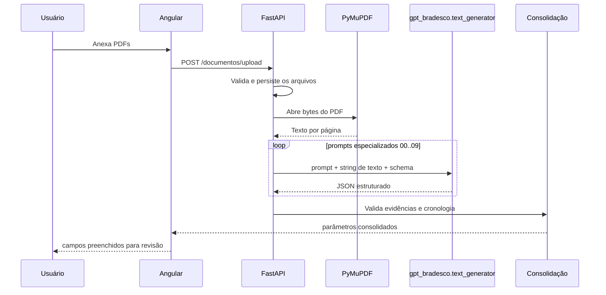

# Fluxo visual da extração

A leitura do PDF ocorre localmente. Não há upload para serviço de OCR no fluxo de extração.

## Seleção de contexto

Antes de cada prompt, `PromptPageRouter` pontua as páginas por termos do domínio da tarefa. Quando nenhum termo é encontrado, utiliza páginas representativas do início/fim de cada documento. A decisão é determinística e suas métricas são auditadas.
