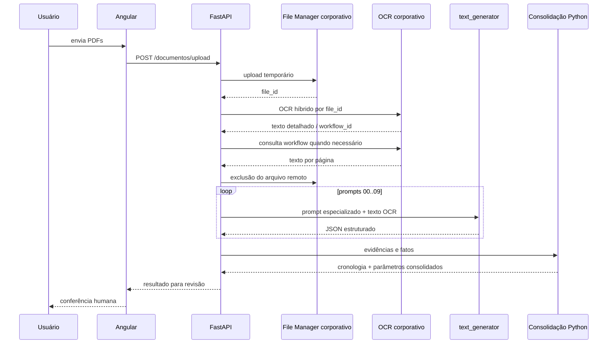

# Fluxo visual da extração



## Exemplo conceitual

```text
PDF: 123_4.pdf
  ↓ OCR
PÁGINA 7: "... juros moratórios de 1% ao mês desde ..."
  ↓ prompt especializado
campo: parametros.juros_moratorios_taxa
valor: 1
página: 7
natureza: comando_decisorio
  ↓ validação Python
ChronologyReducer
  ↓
parâmetro sugerido para revisão humana
```
