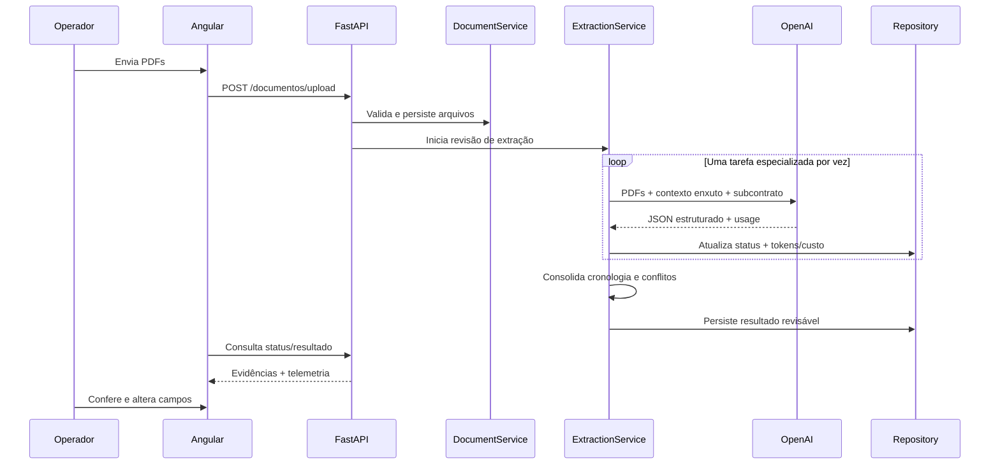
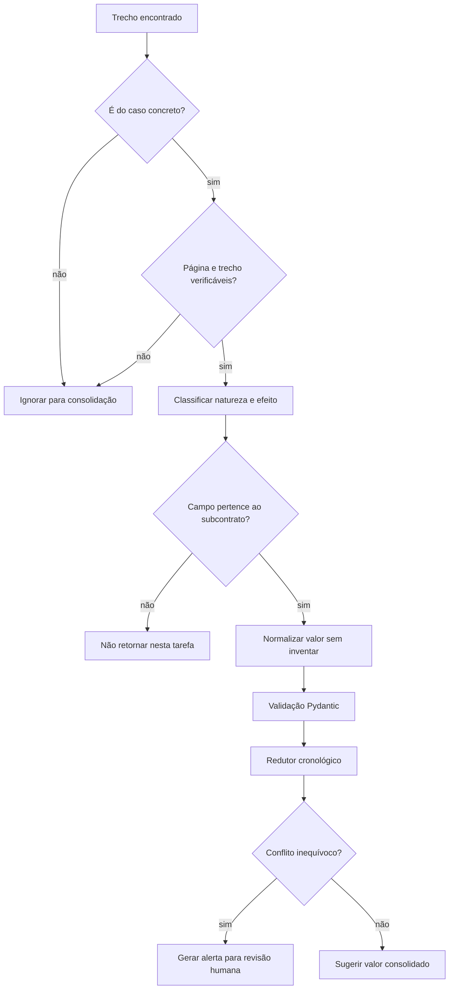

# Fluxo visual da extração documental

## Entrada e separação de responsabilidades



## Como uma evidência vira sugestão



## Exemplo sintético

Documento 1 contém pedido de honorários de 20%. Documento 3 contém sentença fixando 10%. Documento 5 contém acórdão majorando para 15%.

```text
123_1.pdf -> pedido               -> 20%
123_3.pdf -> comando decisório    -> 10%
123_5.pdf -> comando decisório    -> 15% (majora)
                                      |
                                      v
                               sugestão: 15%
```

O exemplo é didático e não representa interpretação aplicável a processos reais. A consolidação depende das evidências extraídas e continua sujeita à revisão humana e, quando necessário, à validação jurídica.
