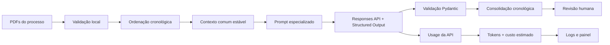

# Extração por IA: custo, tokens e otimização

Este documento explica como a aplicação envia documentos à API, como mede consumo e quais decisões foram tomadas para reduzir custo sem reduzir deliberadamente a cobertura da extração.

## 1. Fluxo completo



Os PDFs são enviados como arquivos nativos. Cada assunto continua separado em uma chamada especializada: classificação, parcelas, correção, juros, encargos, prescrição, compensação, duplo índice e eventos. Essa separação reduz competição entre objetivos e facilita avaliação por etapa.

## 2. O que foi otimizado

### Contexto específico por tarefa

Antes, o schema completo de `CalculationParameters` era repetido em todas as chamadas. Agora `PromptContextBuilder` fornece somente os campos permitidos para a tarefa atual. O catálogo de índices continua disponível apenas onde necessário para evitar inventar chaves.

Exemplo conceitual:

```text
ANTES
base + cronologia + catálogo + schema completo de todos os parâmetros + tarefa

AGORA
base + cronologia + catálogo + subcontrato da tarefa + tarefa
```

### Prefixo estável

As regras comuns ficam no início do prompt. Isso mantém um prefixo idêntico entre chamadas do mesmo processo e favorece mecanismos de cache de entrada oferecidos pelo provedor quando disponíveis. O projeto mede separadamente `tokens_entrada_cache` retornados pela API; não presume que o cache ocorreu.

### Limite de saída por tarefa

`config/extraction_tasks.json` define um teto de saída adequado para cada especialidade. Tarefas que podem gerar muitas linhas, como parcelas e eventos, têm orçamento maior. Tarefas paramétricas têm orçamento menor. `OPENAI_MAX_OUTPUT_TOKENS` continua funcionando como teto global de segurança.

## 3. Medição de tokens

Para cada chamada são registrados apenas dados técnicos:

- etapa;
- modelo;
- tokens de entrada;
- tokens de entrada em cache;
- tokens de saída;
- tokens totais;
- duração;
- custo estimado, quando existe tarifa cadastrada.

Nenhum prompt, trecho de documento, chave de API ou conteúdo do PDF é persistido nessa telemetria.

## 4. Cálculo de custo

A tabela fica em `config/model_pricing.json`. O cálculo considera entrada não cacheada, entrada cacheada e saída:

```text
entrada_nao_cacheada = tokens_entrada - tokens_entrada_cache

custo =
  entrada_nao_cacheada * tarifa_entrada
+ tokens_entrada_cache * tarifa_cache
+ tokens_saida * tarifa_saida
```

As tarifas são normalizadas pela unidade declarada no arquivo, atualmente 1.000.000 de tokens.

### Regra de segurança

Se `OPENAI_MODEL` não existir em `model_pricing.json`, a aplicação continua medindo tokens, mas retorna `custo_estimado_usd = null`. Isso evita apresentar um preço não verificado como fato.

## 5. Atualização de preços

1. Confira a página oficial indicada em `source`.
2. Atualize apenas `config/model_pricing.json`.
3. Atualize `verified_at`.
4. Execute os testes de custo.
5. Registre a alteração em `docs/DECISOES.md`.

Preços podem mudar e condições especiais podem existir por região, lote, cache ou contexto. O valor exibido pela aplicação é uma estimativa técnica baseada no catálogo local, não uma fatura.

## 6. Exemplo visual do painel

```text
┌─────────────────┬───────────┬──────────────────┬─────────────────┬───────────────┬────────────────┐
│ Modelo          │ Chamadas  │ Entrada          │ Entrada cache   │ Saída         │ Custo estimado │
├─────────────────┼───────────┼──────────────────┼─────────────────┼───────────────┼────────────────┤
│ gpt-5.6-sol     │ 10        │ 123.456          │ 80.000          │ 8.500         │ US$ ...        │
└─────────────────┴───────────┴──────────────────┴─────────────────┴───────────────┴────────────────┘
```

Os números acima são apenas ilustrativos. A aplicação usa somente valores reais devolvidos pela API durante cada extração.

## 7. Arquivos responsáveis

| Arquivo | Responsabilidade |
|---|---|
| `backend/services/extraction.py` | Orquestra chamadas, budgets e agregação da telemetria |
| `backend/services/token_usage.py` | Interpreta `usage` e calcula custo |
| `backend/services/prompt_context.py` | Monta contexto enxuto por tarefa |
| `config/extraction_tasks.json` | Limites de saída por especialidade |
| `config/model_pricing.json` | Tarifas verificadas por modelo |
| `prompts/*.md` | Regras especializadas de extração |
| `frontend/.../extraction-log.component.ts` | Exibe consumo agregado ao operador |

## 8. Decisões e trade-offs

- Mantivemos múltiplas chamadas especializadas porque reduzir chamadas por fusão de tarefas poderia diminuir custo, mas aumentaria risco de omissões e mistura de domínios. Essa hipótese deve ser comparada em avaliação controlada antes de mudar a arquitetura.
- O projeto não estima tokens antes da chamada para faturamento. A fonte de verdade é o `usage` devolvido pelo provedor.
- Não é feita seleção automática de modelo mais barato por tipo de documento. Essa otimização só deve ser habilitada após avaliação de acurácia por tarefa e validação do time responsável.
