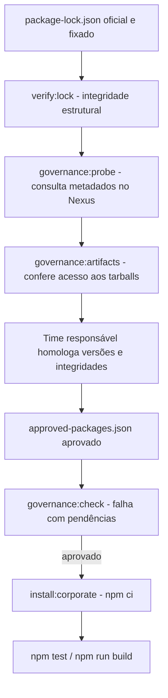

# Validação corporativa das dependências do frontend

**Escopo:** somente `frontend/`, Angular 21.2.21. **Data da revisão:** 16/09/2026.

## Resultado atual, sem pressupor autorização

O projeto foi regenerado a partir da última versão com dependências oficiais. Foram mantidas as substituições de versões feitas anteriormente para `update-browserslist-db@1.3.3`, `negotiator@1.0.0` e `content-type@2.0.0` nos consumidores que aceitam `^2.0.0`. Nenhum outro pacote foi trocado por suposição: não existe catálogo de versões aprovadas ou resultado da consulta ao Nexus disponibilizado nesta sessão. Bibliotecas oficiais publicadas no npm **não são automaticamente homologadas no banco**.

O `package-lock.json` mantém as versões e integridades declaradas. As URLs originais do registro público no lockfile são referências de publicação, **não instrução para usar o npm público**: o npm pode substituir o host `registry.npmjs.org` pelo registry configurado, usando `replace-registry-host=npmjs` (ver [configuração oficial do npm](https://docs.npmjs.com/cli/v10/using-npm/config/#replace-registry-host)). A política corporativa pode exigir outro tratamento; obtenha validação do time responsável. Não desative verificações TLS, não use `--force`, não use `--legacy-peer-deps`, não troque o registry por um público e não versione credenciais.

## Visão geral do processo



A consulta ao Nexus comprova **disponibilidade e acesso com as credenciais do executor**, não conformidade jurídica, de segurança ou de licenças. O catálogo de aprovação é uma evidência independente que deve ser obtida do fluxo de governança; preencher o arquivo sem essa autorização não concede aprovação.

## Passo a passo para Windows / PowerShell

Acesse `frontend/`, usando o Node e npm aprovados pelo banco e a configuração de autenticação corporativa já provisionada fora do repositório.

```powershell
cd frontend
npm config get registry
npm run verify:lock
npm run governance:probe
npm run governance:artifacts
```

O pré-diagnóstico **recusa o registry público**, exige HTTPS e verifica se existem registries divergentes por escopo (`@angular`, etc.). Por padrão, confere todas as versões distintas candidatas ao Windows x64, incluindo opcionais que podem ser necessários para compilar. `governance:probe` verifica metadados e igualdade da integridade SHA-512; **não baixa todos os tarballs**. `governance:artifacts` faz adicionalmente `npm cache add` para cada versão, com cache temporário isolado e sem executar scripts de instalação. Pode demorar devido ao número de artefatos e à latência do Nexus. Não faz instalação do projeto. Os relatórios ficam em `frontend/reports/nexus-preflight.csv`, ignorado pelo Git. Não envie logs brutos contendo URLs autenticadas, tokens, headers de autenticação ou configurações completas `.npmrc`.

Para um diagnóstico rápido e **parcial**, antes de consultar tudo:

```powershell
node scripts/nexus-preflight.mjs --max=10
```

O resultado parcial não garante a disponibilidade da árvore completa. Para testar apenas pacotes necessários segundo metadados, existe `--required-only`, mas a compilação poderá precisar de opcionais nativos. O script usa os metadados do lockfile e **não é uma captura exata das decisões internas do npm**.

Depois que a governança devolver a lista autorizada, copie `frontend/config/approved-packages.example.json` para `frontend/config/approved-packages.json` e inclua somente aprovações verdadeiras no formato abaixo, com o **hash SHA-512 exato do lockfile**, preservando a identidade do artefato:

```json
{
  "schema_version": 1,
  "packages": [
    {
      "name": "PACOTE_APROVADO_PELO_BANCO",
      "version": "VERSAO_APROVADA",
      "integrity": "sha512-HASH_FORNECIDO_E_VALIDADO",
      "status": "approved"
    }
  ]
}
```

O exemplo acima é ilustrativo e **não é uma aprovação real**. O arquivo completo deve conter uma entrada para cada artefato distinto exigido, inclusive dependências transitivas e opcionais candidatas ao Windows x64. O catálogo é ignorado pelo Git. Alternativamente, aponte `NPM_APPROVED_PACKAGES_FILE` para um arquivo protegido, em caminho local aprovado. Não coloque informações pessoais ou credenciais nesse JSON.

```powershell
npm run governance:check
npm run install:corporate
npm test
npm run build
```

`governance:check` retorna erro com aprovações faltantes, recusadas ou integridades diferentes. `install:corporate` roda o controle **antes** de chamar `npm ci`. Um `npm ci` executado diretamente não passa por esse controle; a equipe deve exigir `install:corporate` no pipeline CI/CD para tornar o gate obrigatório. A aprovação não substitui SCA, SBOM, verificação de licenças, antivírus/EDR, revisão de scripts de instalação nem o build funcional.

## Caso um pacote falhe

Consulte `frontend/reports/nexus-preflight.csv` e forneça ao time responsável: nome, versão, se é opcional, tipo de falha e hash declarado. Não mude versões ou retire dependências por tentativa e erro. Para cada substituição candidata, exija: versão oficial no catálogo aprovado, compatibilidade declarada do consumidor, revisão de licença/segurança, atualização controlada do lockfile e repetição de instalação, testes e build.

Falhas `E401` / `E403` podem envolver autenticação, permissões ou política de bloqueio; `E404` pode indicar artefato não publicado no proxy; problemas de DNS e certificados devem ser tratados pela infraestrutura. `INTEGRIDADE_DIVERGENTE` exige investigação antes de qualquer instalação.

## O que permanece pendente

- Consulta com credenciais autorizadas e resultado real de disponibilidade de todos os tarballs no Nexus.
- Lista corporativa de versões homologadas, integridades aprovadas e políticas de execução de scripts.
- Avaliação SCA/licenças e testes `npm ci`, `npm test`, `npm run build` no Windows corporativo.

**Não há declaração de homologação nesta entrega.** Esta versão oferece inventário, rastreabilidade e verificações repetíveis para obter a evidência necessária sem contornar a governança.
